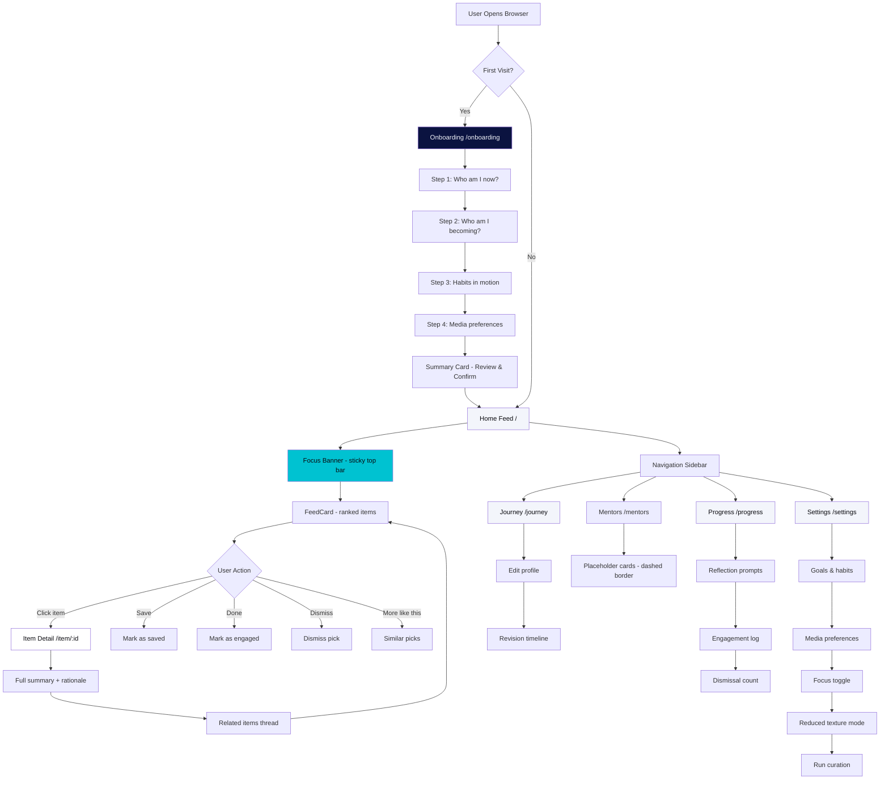
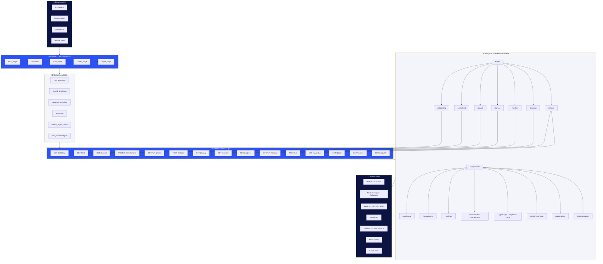

# NextSelf — Your Growth Compass

A personal-growth curation platform that understands who you are becoming and picks the media, knowledge, and experiences that serve that journey. Built as a **blue neo-brutalist** field journal — hard edges, halftone mesh accents, and honest stub labels everywhere.

  

---

## Table of Contents

- [Overview](#overview)
- [Features](#features)
- [Architecture](#architecture)
  - [App Flow](#app-flow)
  - [System Build](#system-build)
- [Tech Stack](#tech-stack)
- [Design System](#design-system)
- [Project Structure](#project-structure)
- [Setup](#setup)
- [API Reference](#api-reference)
- [Real vs Stubbed Features](#real-vs-stubbed-features)
- [Contributing](#contributing)
- [License](#license)

---

## Overview

NextSelf is a **single-user personal-growth compass**. It runs a real AI curation pipeline (fetch → score → cluster → digest) and surfaces the results through a polished, neo-brutalist web interface. The user sets their identity goals and habits during onboarding, then receives a daily feed of curated picks ranked by relevance.

The platform is honest about what is real and what is stubbed — every placeholder is clearly labeled, and no fake data pretends to be live.

---

## Features

### Core Curation
- **Real pipeline execution** — fetch articles/papers/videos from RSS, web, and social sources; score by relevance; cluster into threads; generate an HTML digest
- **Ranked feed** — items ordered by composite score (engagement, novelty, alignment with your focus)
- **"Why this pick" rationale** — every feed item includes a collapsed mono footnote explaining the ranking logic
- **Media-type filtering** — preferences stored in user state × item metadata (article, paper, video)

### User Journey
- **Onboarding guard** — first-time users draw their compass (who you are now, who you're becoming, habits, media preferences)
- **Journey & Identity** — edit your seed profile; every confirmation creates a revision entry in the timeline
- **Progress & Reflection** — engagement log (saved / done / dismissed), reflection prompts, quiet journal card
- **Mentors & Experiences** — placeholder cards for future people/communities/events data source (dashed border = not real yet)

### Interface
- **Blue neo-brutalist design** — void sidebar, comic focus banner, hard ink borders, flat shadows, halftone mesh accents
- **7 pages** — onboarding, home feed, item detail, journey, mentors, progress, settings
- **Responsive** — sidebar collapses to bottom bar on mobile (<768px)
- **Reduced-texture mode** — strips grain, mesh, and glitch for a calmer view
- **Honest copy** — "PLACEHOLDER — NO DATA SOURCE YET", "Curation, not attention", "No streaks, no scores"

### Backend
- **FastAPI layer** — wraps the CLI pipeline as a proper HTTP API
- **Single-user state store** — JSON file at `outputs/user_state/state.json`
- **Background pipeline runs** — trigger `run_pipeline.py` as a subprocess, poll status
- **Static file serving** — `outputs/` mounted at `/outputs`

---

## Architecture

### App Flow



### System Build



---

## Tech Stack

| Layer | Technology | Version |
|-------|-----------|---------|
| Frontend framework | Next.js (App Router) | 16.2.12 |
| Frontend language | TypeScript | — |
| Styling | Tailwind CSS v4 | — |
| Fonts | Archivo Black, Space Grotesk, JetBrains Mono | — |
| Icons | Lucide React | — |
| State management | React Query (TanStack Query) | — |
| Backend framework | FastAPI | — |
| Backend language | Python | 3.11 |
| Pipeline | `run_pipeline.py` (CLI → subprocess) | — |
| AI model | Gemini (gemini-3.5-flash-lite / gemini-3.5-flash) | — |
| Build tool | Turbopack (Next.js default) | — |
| Package manager | npm | 11.6.2 |

---

## Design System

### Tokens

| Token | Value | Usage |
|-------|-------|-------|
| `--void` | `#0B1340` | Sidebar background |
| `--cobalt` | `#2A52F5` | Primary accent, active nav |
| `--cobalt-dark` | `#1B3ACC` | Text on white (AA contrast) |
| `--halftone-cyan` | `#00C2D1` | Secondary, focus rings, mesh dots |
| `--spider-magenta` | `#FF2D78` | Signature accents only (focus banner, glitch, milestones) |
| `--paper` | `#F3F5FB` | Page background |
| `--ink` | `#0A0A0F` | Borders, shadows, headlines |
| `--card` | `#FFFFFF` | Card surfaces |
| `--muted` | `#5A6072` | Secondary text |

### Typography

| Role | Font | Weight | Scale |
|------|------|--------|-------|
| Display | Archivo Black | 400 | `text-3xl` → `text-4xl` |
| Body | Space Grotesk | 400 | `text-sm` → `text-base` |
| Mono / Utility | JetBrains Mono | 400 | `text-[11px]`, uppercase, 0.08em tracking |

### Spacing Scale

`4 / 8 / 12 / 16 / 24 / 32 / 48 / 64 / 96`

### Neo-Brutalist Rules

- **0px radius** on structural elements (round only avatars + diamond markers)
- **2px solid ink borders** everywhere
- **Hard shadows**: `4px 4px 0 ink` (cards), `2px 2px 0 ink` (buttons)
- **Press state**: shadow collapses to 0, element shifts 2px
- **No blur, no gradients on structural elements**

### Mesh Layer (Rare)

- Halftone dots: `radial-gradient(rgba(0,194,209,0.13) 1.5px, transparent 1.5px)`, 14px grid
- Used only in: focus banner, empty states, milestone markers, mentor placeholders
- Magenta glitch (2-3px offset ghost border, 120ms) on primary CTAs and focus banner diamond
- Comic panel dividers: `angle-divider` (3px, `skewX(-18deg)`), max 1–2 per page

### Motion

| Animation | Duration | Easing |
|-----------|----------|--------|
| Settle (cards slide-up) | 150ms | `ease-out` |
| Stagger per card | 30ms delay | — |
| Glitch (magenta edge) | 120ms | `ease-in-out` |
| Toggle switch | 100ms | `ease-in-out` |
| Focus ring | 150ms | — |

All motion respects `prefers-reduced-motion`.

---

## Project Structure

```
nextself/
├── api/                          # FastAPI backend
│   ├── main.py                   # FastAPI app, routes, CORS
│   ├── feed.py                   # Feed builder with clean_summary()
│   └── state.py                  # Single-user JSON state store
├── frontend/                     # Next.js 16 app
│   ├── app/
│   │   ├── layout.tsx            # Root layout, font imports
│   │   ├── globals.css           # Design tokens, all surface classes
│   │   ├── onboarding/
│   │   │   └── page.tsx          # "Draw your compass" (4 steps)
│   │   ├── (app)/
│   │   │   ├── layout.tsx        # App shell (sidebar + focus banner)
│   │   │   ├── page.tsx          # Home feed
│   │   │   ├── journey/
│   │   │   │   └── page.tsx      # Profile + revision timeline
│   │   │   ├── mentors/
│   │   │   │   └── page.tsx      # Placeholder cards + BackendGap
│   │   │   ├── progress/
│   │   │   │   └── page.tsx      # Engagement log + quiet quote
│   │   │   └── settings/
│   │   │       └── page.tsx      # Goals, media prefs, texture toggle
│   │   └── item/
│   │       └── [id]/
│   │           └── page.tsx      # Item detail + related thread
│   ├── components/
│   │   ├── AppSidebar.tsx        # Void sidebar / bottom bar
│   │   ├── FocusBanner.tsx       # Comic focus banner (sticky top)
│   │   ├── FeedCard.tsx          # Feed item card (mono meta, actions)
│   │   ├── OnboardingGuard.tsx   # Session gate
│   │   ├── Providers.tsx         # React Query + Theme provider
│   │   ├── TextureMode.tsx       # Reduced-texture toggle
│   │   └── ui/                   # Component library
│   │       ├── HardCard.tsx      # Neo-brutalist card (dashed/mesh/grain)
│   │       ├── Buttons.tsx       # PrimaryButton + OutlineButton
│   │       ├── StepDots.tsx      # Onboarding progress indicator
│   │       ├── TypeBadge.tsx     # Media type tag (void bg, mono)
│   │       ├── SectionHeading.tsx # Display headline + mono sub
│   │       ├── BackendGap.tsx    # Honest backend-gap callout
│   │       ├── Toggle.tsx        # Square hard switch
│   │       ├── StringListEditor.tsx # Ink chip list editor
│   │       └── MediaPrefsPicker.tsx # Media preference toggles
│   ├── hooks/
│   │   └── useApi.ts             # React Query hooks for all endpoints
│   ├── lib/
│   │   ├── api.ts                # API client utilities
│   │   ├── types.ts              # TypeScript interfaces
│   │   └── utils.ts              # cn(), formatDate() helpers
│   ├── next.config.ts            # Proxy rewrites to backend
│   └── README.md
├── .env                          # GEMINI_API_KEY + model config
├── .env.example
├── .gitignore
├── pyproject.toml
├── requirements.txt
└── README.md                     # This file
```

---

## Setup

### Prerequisites

- **Python 3.11** — `winget install Python.Python.3.11`
- **Node 24+** — `winget install OpenJSF.NodeJS`
- **Git** — `winget install Git.Git`

### Backend

```powershell
cd nextself

# Create virtual environment (first time only)
python -m venv .venv

# Activate
.venv\Scripts\activate

# Install dependencies
pip install -r requirements.txt

# Set your API key
$env:GEMINI_API_KEY = "your-key-here"

# Start the backend
uvicorn api.main:app --host 127.0.0.1 --port 8000
```

### Frontend

```powershell
cd nextself\frontend

# Install dependencies
npm install

# Start dev server
npm run dev            # http://localhost:3000
```

### First Run

1. Open `http://localhost:3000`
2. Complete the onboarding ("Draw your compass") — 4 steps
3. Confirm the summary card to reach the feed
4. The feed shows real pipeline results with "why this pick" rationale

---

## API Reference

All endpoints are prefixed with `/api`. The frontend proxies via `next.config.ts`.

| Method | Endpoint | Purpose |
|--------|----------|---------|
| GET | `/bootstrap` | Onboarding state, profile, settings, current moment |
| GET | `/feed?limit&offset&media_filter` | Curated feed from pipeline clusters |
| GET | `/feed/{id}` | Item detail + members + related picks |
| POST | `/items/{id}/actions` | `saved \| dismissed \| done \| more_like_this` |
| GET/PUT | `/profile` | Read / edit the seed profile |
| POST | `/onboard` | Confirm onboarding (records first journey entry) |
| GET | `/journey` | Profile + revision timeline |
| GET | `/mentors` | **STUB** — placeholder cards (dashed border) |
| GET | `/progress` | Engagement log + reflection prompts |
| GET/PUT | `/settings` | Goals/habits, media prefs, focus, texture toggle |
| POST/GET | `/run` | Trigger pipeline run / check status |
| GET | `/digest` | Link to the HTML digest report |
| GET | `/sources` | Source names used in the pipeline |
| GET | `/outputs/*` | Static files from the outputs directory |

---

## Real vs Stubbed Features

| Feature | Status | Source |
|---------|--------|--------|
| Feed items, detail, "why this pick" | ✅ **Real** | Pipeline `clustered_items.json` + `scored_items.json` |
| Media-type filter on feed | ✅ **Real** | User preference × item metadata |
| Profile / journey history / actions / settings | ✅ **Real** | `outputs/user_state/state.json` |
| "Run curation" (pipeline trigger) | ✅ **Real** | Subprocess of `run_pipeline.py` |
| Mentors & Experiences | 🟠 **Stubbed** | No people/events data source — dashed placeholder cards |
| Per-user personalized curation | 🟠 **Partial** | Same feed for everyone; profile edits persist but don't re-rank yet |
| Onboarding → feed shaping | 🟠 **Acknowledgment only** | Profile saves and is acknowledged; no live re-training |

---

## Contributing

1. Fork the repository
2. Create a feature branch: `git checkout -b feature/your-feature`
3. Commit changes: `git commit -m "Add your feature"`
4. Push to the branch: `git push origin feature/your-feature`
5. Open a Pull Request

### Code Conventions

- **Frontend**: TypeScript, App Router, React Query, Tailwind CSS v4
- **Backend**: Python 3.11, FastAPI, type hints
- **Design**: Neo-brutalist tokens only — no custom CSS per component, all tokens in `globals.css`
- **Honesty**: All stubs/placeholders must be clearly labeled (dashed borders, "Placeholder — no data source yet")
- **Motion**: Respect `prefers-reduced-motion` on all animations

---

## License

MIT License — see [LICENSE](LICENSE) for details.

---

## Acknowledgments

- Built with [Next.js](https://nextjs.org/) + [FastAPI](https://fastapi.tiangolo.com/)
- Design inspired by neo-brutalism and Spider-Verse color theory
- Pipeline powered by Gemini API
- Icons by [Lucide](https://lucide.dev/)
